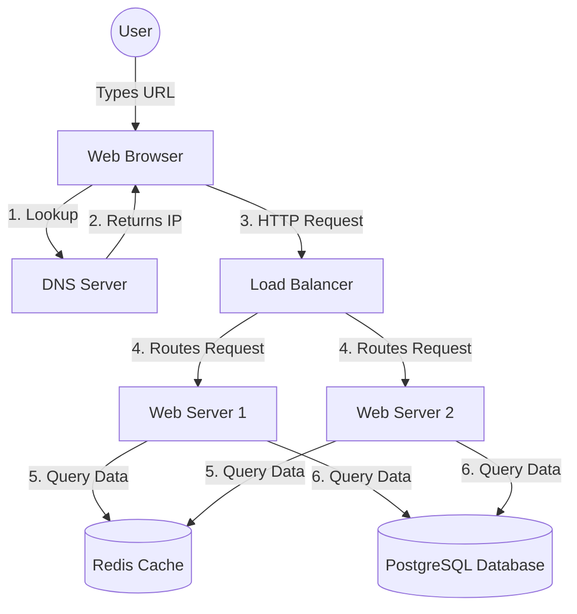

# Examples Directory

This directory contains practical examples and visualizations of the concepts taught in the Computer Science Foundations module. Since this module focuses on theory before coding, these examples are primarily structural diagrams and basic scripts to inspect your system.

## 1. System Architecture (Mermaid)
Below is an example of a modern web architecture, demonstrating how DNS, Clients, Servers, and Databases interact.



## 2. Checking Local IP (Command Line)
To see your computer's IP address on your local network:
- **Windows:** Open Command Prompt and type `ipconfig`. Look for "IPv4 Address".
- **Mac/Linux:** Open Terminal and type `ifconfig` or `ip a`. Look for "inet".

## 3. Big O Notation Visualized (JavaScript)

```javascript
// O(1) - Constant Time
// It doesn't matter if the array has 10 items or 10 million items, 
// grabbing the first item takes the exact same amount of time.
function getFirstItem(array) {
  return array[0]; 
}

// O(n) - Linear Time
// If the array has 10 items, it prints 10 times. 
// If it has 1,000 items, it prints 1,000 times. Time scales 1:1 with data.
function printAllItems(array) {
  for (let i = 0; i < array.length; i++) {
    console.log(array[i]);
  }
}

// O(n^2) - Quadratic Time
// For every 1 item, it loops through the entire array again.
// 10 items = 100 operations. 1,000 items = 1,000,000 operations!
// This is why nested loops can crash servers if data gets too big.
function findDuplicates(array) {
  for (let i = 0; i < array.length; i++) {
    for (let j = 0; j < array.length; j++) {
      if (i !== j && array[i] === array[j]) {
        console.log("Found a duplicate:", array[i]);
      }
    }
  }
}
```
