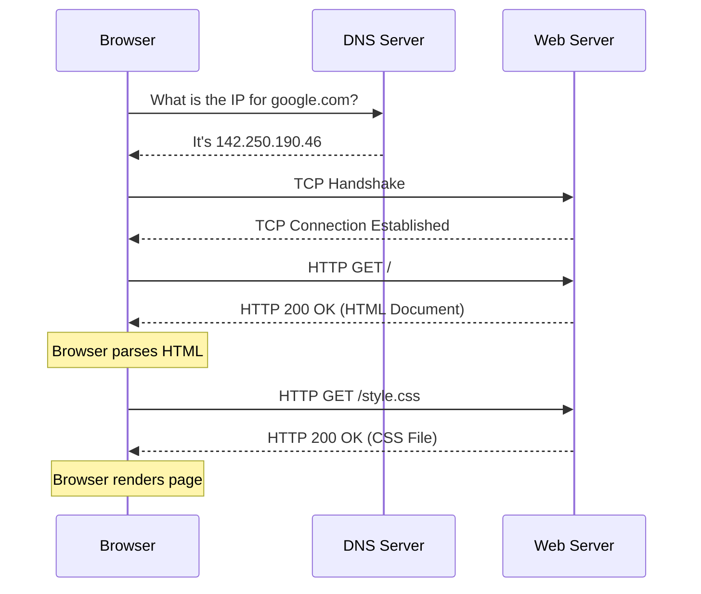

# Lesson 05: How the Web Works

## Learning Objectives
- Explain the components of a URL.
- Trace the lifecycle of an HTTP request (what happens when you type google.com).
- Understand HTTP methods, status codes, and headers.
- Explain the concept of statefulness on the web (Cookies, Sessions).

## Prerequisites
- Lesson 04 (Networking Fundamentals).

## Concept Explanation
The Web (World Wide Web) is a collection of documents and applications accessed over the Internet using the **HTTP** (Hypertext Transfer Protocol).

### URLs (Uniform Resource Locators)
A URL tells the browser exactly what to get and how to get it.
`https://www.example.com:443/path/to/page?search=hello#section2`
- **Protocol**: `https://` (How to connect)
- **Domain**: `www.example.com` (Who to connect to)
- **Port**: `:443` (The specific door on the server. Usually hidden, defaults to 80 for HTTP and 443 for HTTPS)
- **Path**: `/path/to/page` (The specific file or route)
- **Query Parameters**: `?search=hello` (Extra data sent to the server)
- **Fragment**: `#section2` (A specific spot on the page; handled by the browser)

### What Happens When You Type "google.com"?
1. **DNS Lookup**: Browser checks its cache. If not found, it asks the OS, then the DNS resolver to find Google's IP address.
2. **TCP Connection**: The browser establishes a TCP connection with Google's server (the Three-Way Handshake). If using HTTPS, a TLS handshake also occurs to encrypt data.
3. **HTTP Request**: The browser sends a GET request to the server.
4. **Server Response**: The server processes the request and sends back an HTTP Response containing HTML.
5. **Rendering**: The browser parses the HTML. When it finds links to CSS, JS, or images, it fires off *more* HTTP requests to fetch those. It then paints the page on your screen.

### HTTP Basics
HTTP is **stateless**. The server forgets who you are the moment the request is finished. 
- **Methods**: GET (fetch data), POST (send data), PUT (update data), DELETE.
- **Status Codes**: 
  - 2xx (Success, e.g., 200 OK)
  - 3xx (Redirect, e.g., 301 Moved Permanently)
  - 4xx (Client Error, e.g., 404 Not Found, 401 Unauthorized)
  - 5xx (Server Error, e.g., 500 Internal Server Error)
- **State via Cookies**: To remember you're logged in, the server sends a "Cookie" with the response. Your browser automatically sends that cookie back on all future requests, proving your identity.

## WHY it exists
HTTP provides a standard language for clients and servers to talk. Knowing the exact sequence of events helps you debug why a page is slow (Is it DNS? A slow database query? Downloading a massive image?).

## Mental Model & Real-World Analogy
**Ordering at a Drive-Thru**
- **URL/DNS**: Looking up the address of the restaurant.
- **TCP Connection**: Pulling up to the speaker box and saying "Hello?". They say "Go ahead".
- **HTTP Request**: "I would like a burger" (GET /burger).
- **HTTP Response**: They hand you the burger in a bag (200 OK).
- **Statelessness**: If you drive around to the window again and say "I want another one," they don't know you just bought a burger. To them, you are a brand new customer. 
- **Cookies**: Giving you a VIP card. Next time you pull up, you show the card so they remember your preferences.

## Common Mistakes
- **Mixing up GET and POST**: Sending sensitive data (like a password) in a GET request puts the password in the URL, where it gets saved in browser history and server logs. Always use POST for sensitive data.

## Exercises
1. Open your browser's Developer Tools (F12 or Right Click -> Inspect). Go to the "Network" tab. Reload a webpage. Look at the very first request. What is its Status Code? What HTTP Method did it use?
2. Find one image request in the Network tab. How many milliseconds did it take to download?

## Summary
The web relies on DNS to find servers and HTTP to communicate with them. Browsers orchestrate dozens of requests just to load a single page, relying on cookies to maintain state across a stateless protocol.

## Completion Checklist
- [ ] I can explain the parts of a URL.
- [ ] I can walk through the steps of loading a webpage.
- [ ] I know the difference between 200, 404, and 500 HTTP status codes.
- [ ] I understand how cookies solve HTTP's statelessness.
