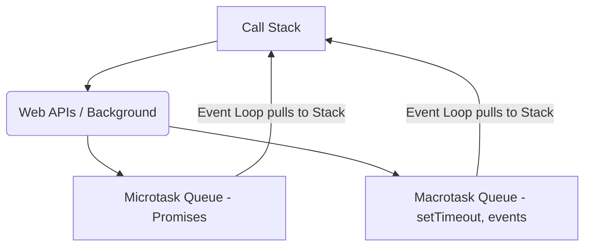

# Lesson 13: Asynchronous JavaScript & The Event Loop (CRITICAL)

## Learning Objectives
- Understand why JS is single-threaded but handles concurrency.
- Master the Event Loop, Call Stack, Task Queue, and Microtask Queue.
- Understand Callbacks and the problem of "Callback Hell".

## The Problem: Single-Threaded Nature
JavaScript has exactly **one Call Stack**. It can only do one thing at a time.
If you have a function that takes 5 seconds to run (e.g., a massive `while` loop), the entire browser freezes for 5 seconds. You can't click buttons, scroll, or see animations. This is called **Blocking the Main Thread**.

### Real-World Analogy
Imagine a restaurant with exactly **one chef (the Call Stack)**. 
- If a customer orders toast (quick task), the chef makes it immediately.
- If a customer orders a slow-roasted turkey (slow network request), does the chef stand by the oven for 4 hours doing nothing? No! 
- The chef puts the turkey in the oven (Web APIs), sets a timer, and moves on to the next customer's order. When the timer goes off (Callback Queue), the chef takes the turkey out.

## The Event Loop Architecture

1. **Heap:** Where memory allocation happens (variables, objects).
2. **Call Stack:** Where your functions are pushed when executed and popped when finished.
3. **Web APIs:** Provided by the browser (or Node.js). E.g., `setTimeout`, `fetch`, DOM events. They do the heavy lifting in the background.
4. **Task (Callback) Queue:** Where callbacks from Web APIs wait when they are done.
5. **Microtask Queue:** A VIP queue for Promises. It empties *before* the Task Queue.
6. **The Event Loop:** A continuous loop that checks: *Is the Call Stack empty? If yes, take the first item from the Microtask Queue and push it to the stack. If empty, check the Task Queue.*



## Callbacks
A callback is just a function passed into another function, intended to be executed at a later time.

```javascript
console.log("1. Start");

setTimeout(() => {
  console.log("2. Timeout Finished");
}, 1000);

console.log("3. End");

// Output:
// 1. Start
// 3. End
// 2. Timeout Finished
```
*Why? `setTimeout` is sent to the Web API. The stack moves to "3. End". One second later, the callback goes to the Queue, the stack is empty, and the Event Loop pushes the callback onto the stack.*

## Callback Hell
When you have multiple asynchronous tasks that depend on each other, callbacks become nested.
```javascript
loginUser("alice", (user) => {
  getUserProfile(user.id, (profile) => {
    getUserPosts(profile.id, (posts) => {
      console.log("Finally got posts:", posts);
    });
  });
});
```
This "pyramid of doom" is hard to read and hard to handle errors in. This led to the creation of **Promises** (covered in the next lesson).

## Summary Checklist
- [ ] Understand blocking vs non-blocking code.
- [ ] Memorize the pieces: Stack, Web API, Queues, Event Loop.
- [ ] Understand Microtasks vs Macrotasks.
- [ ] Identify Callback Hell.
