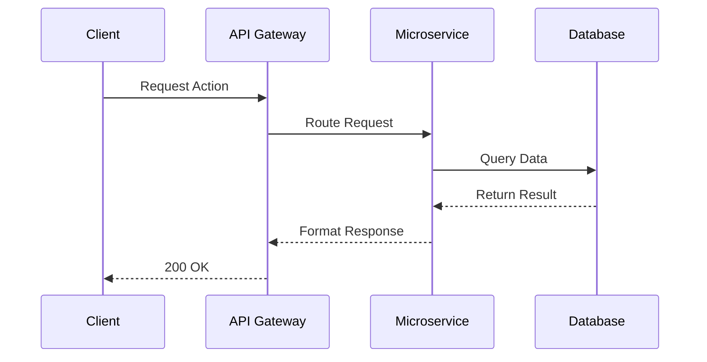

# Authentication Fundamentals

## Learning Objectives
By the end of this lesson, you will be able to:
- Understand the core concepts of Authentication Fundamentals.
- Implement best practices for Authentication Fundamentals in a production environment.
- Analyze the performance and security implications.

## 1. Introduction and Mental Model
When building modern web applications, **Authentication Fundamentals** plays a critical role. Think of it like the nervous system of your application architecture. 

### Why Does This Exist?
Historically, systems were tightly coupled. As we moved towards distributed systems, the need for robust, scalable Authentication Fundamentals became paramount.

> **Analogy:** Imagine a restaurant. The kitchen is your database, the waiter is your API, and the customer is the client. Authentication Fundamentals is the set of rules dictating how the waiter takes orders and delivers food.

## 2. Core Concepts and Syntax

Here is how you typically implement Authentication Fundamentals in a modern Node.js/TypeScript environment.

```typescript
// Example implementation related to Authentication Fundamentals
import { Injectable } from '@nestjs/common';

@Injectable()
export class AuthenticationFundamentalsService {
  execute() {
    console.log('Executing Authentication Fundamentals logic');
    // Implementation details
    return {
      status: 'success',
      timestamp: new Date().toISOString()
    };
  }
}
```

### Common Mistakes
- **Ignoring Edge Cases:** Developers often design for the happy path and forget network failures.
- **Poor Naming:** Naming variables and endpoints inconsistently.
- **Security Flaws:** Not validating inputs properly.

## 3. Architecture and Deep Dive

Let's visualize the flow using a Mermaid diagram:



## 4. Production Considerations

### Performance
Always consider caching and indexing. If Authentication Fundamentals involves heavy computation, consider moving it to a background worker.

### Security
Validate ALL inputs. Sanitize data before it hits your database to prevent SQL Injection and XSS. Implement rate limiting to prevent DDoS.

## 5. Exercises and Challenge
1. **Basic:** Implement a basic version of Authentication Fundamentals.
2. **Intermediate:** Add error handling and input validation.
3. **Advanced:** Scale the implementation to handle 10,000 requests per second.

## 6. Summary and Checklist
- [ ] I understand the mental model of Authentication Fundamentals.
- [ ] I can write the basic implementation.
- [ ] I know the common security pitfalls.
