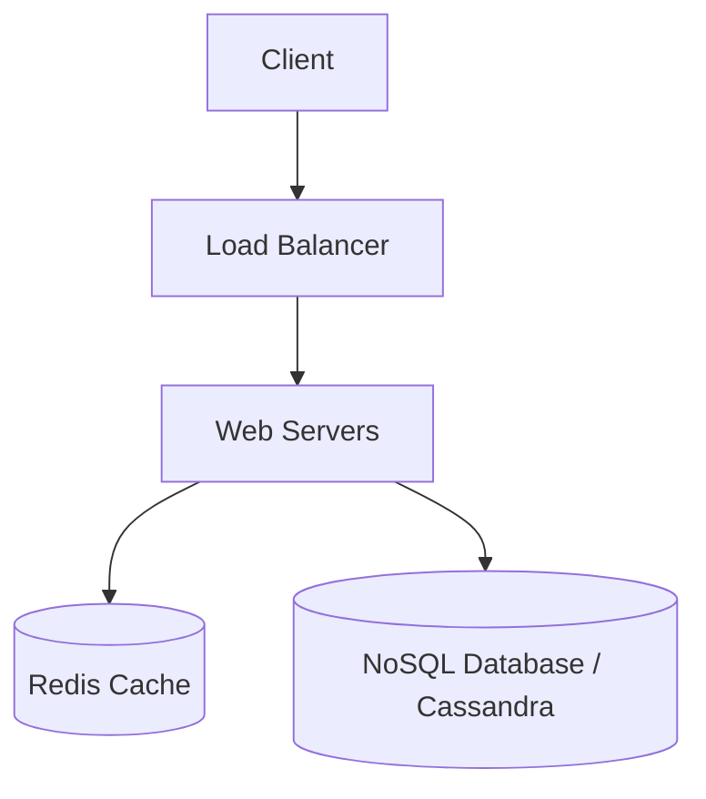

# Lesson 11: Design a URL Shortener

## 1. Learning Objectives
- Map out functional and non-functional requirements for a real-world system.
- Apply hashing strategies and base62 encoding.
- Design the database schema and scaling strategy.

## 2. Requirements
**Functional:**
- Given a URL, generate a shorter alias.
- When users click the alias, redirect to the original URL.
- Links expire after a default timespan.

**Non-Functional:**
- Highly available (AP system).
- URL redirection should have minimal latency.
- Not guessable (optional but good).

## 3. High-Level Design

## 4. Hashing and Encoding
How do we turn a long URL into 7 characters?
- **Base62 Encoding:** A-Z, a-z, 0-9 = 62 characters. $62^7 = 3.5$ trillion URLs.
- Generate a unique ID (using a ticket server or Snowflake), then convert that integer to Base62.

## 5. Summary and Checklist
- [ ] Understand why a RDBMS might not be the best choice at high scale for this specific use case.
- [ ] Diagram the read vs write flow.
