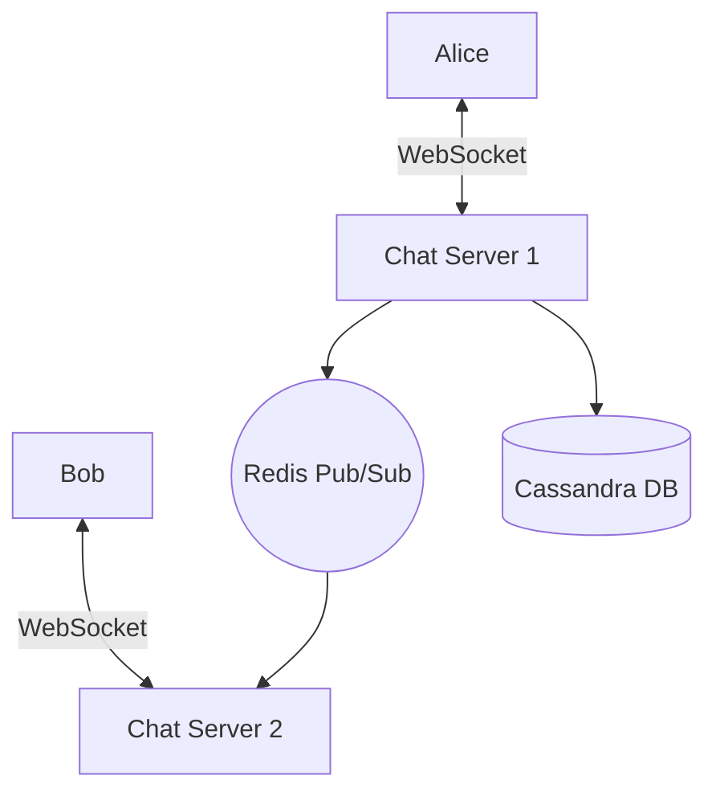

# Lesson 12: Design a Chat Application

## 1. Learning Objectives
- Architect real-time bi-directional communication using WebSockets.
- Design message storage for chat history.
- Handle user presence (online/offline status).

## 2. Requirements
- 1-on-1 and Group chats.
- Real-time delivery.
- Online presence indicator.

## 3. Architecture

## 4. WebSockets and State
Unlike standard stateless HTTP, WebSockets are stateful persistent connections. If Alice connects to Server 1, Server 1 must hold that connection. If Bob connects to Server 2, how does Alice message Bob?
- **Solution:** Redis Pub/Sub. Server 1 publishes a message to a channel. Server 2 subscribes to that channel and forwards it to Bob.

## 5. Summary and Checklist
- [ ] Contrast long-polling vs WebSockets.
- [ ] Explain how to scale stateful WebSocket servers.
