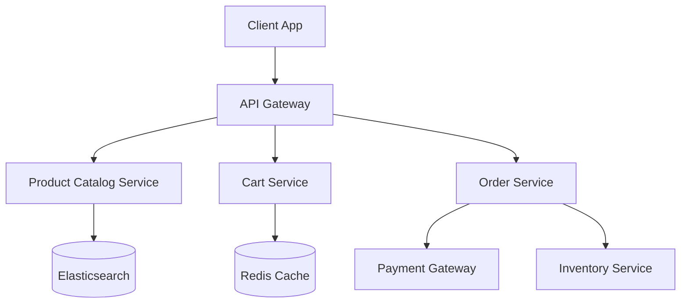

# Lesson 13: Design an E-Commerce System

## 1. Learning Objectives
- Design microservices for specific domains (Cart, Inventory, Payment).
- Understand distributed transactions and the Saga pattern.
- Implement search via Elasticsearch.

## 2. High-Level Architecture

## 3. The Saga Pattern (Distributed Transactions)
In a monolith, placing an order is one SQL transaction. In microservices, it hits Order, Payment, and Inventory. If Payment fails, you must rollback Inventory.
- **Saga Pattern:** A sequence of local transactions. If a step fails, the Saga executes compensating transactions to undo the previous steps.

## 4. Summary and Checklist
- [ ] Design the checkout flow.
- [ ] Understand why search requires a separate indexed datastore.
