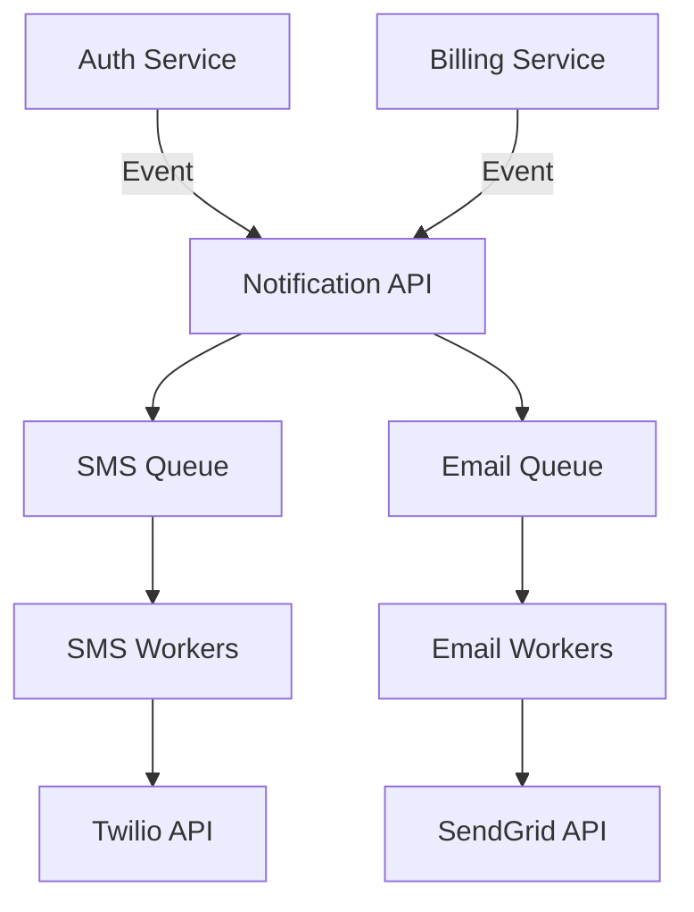

# Lesson 14: Design a Notification System

## 1. Learning Objectives
- Architect a system to send Push, Email, and SMS at scale.
- Implement queues for rate limiting and retry logic.

## 2. Architecture

## 3. Dealing with Third-Party APIs
Third-party APIs (Twilio, APNS) go down or rate limit you.
- Never call them synchronously.
- Always use queues to buffer requests.
- Implement exponential backoff for retries.

## 4. Summary and Checklist
- [ ] Understand the fan-out pattern for notifications.
- [ ] Design a system that doesn't drop notifications on failure.
