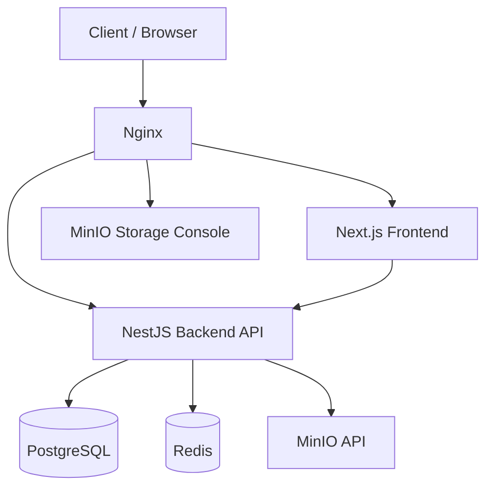

# Lesson 8: Complete Deployment Guide

## Architecture Overview
This lesson provides a complete, step-by-step guide to deploying a modern full-stack application on a VPS.

### Stack Components
- **Frontend:** Next.js (SSR/SSG)
- **Backend:** NestJS (API)
- **Database:** PostgreSQL
- **Cache/Queue:** Redis
- **Object Storage:** MinIO
- **Reverse Proxy:** Nginx
- **Containerization:** Docker & Docker Compose

## Architecture Diagram

## Deployment Steps
1. Provision Server
2. Install Docker and Docker Compose
3. Configure `docker-compose.prod.yml`
4. Setup Nginx Reverse Proxy
5. Configure SSL with Certbot
6. Setup CI/CD with GitHub Actions

*(Detailed steps to be completed in exercises)*
